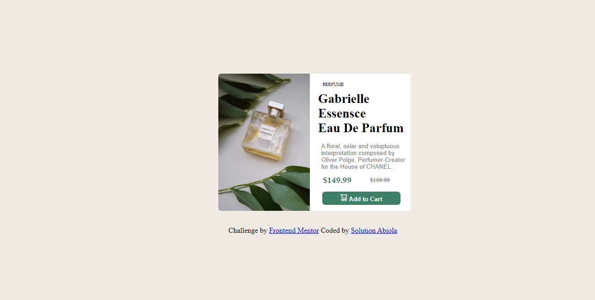
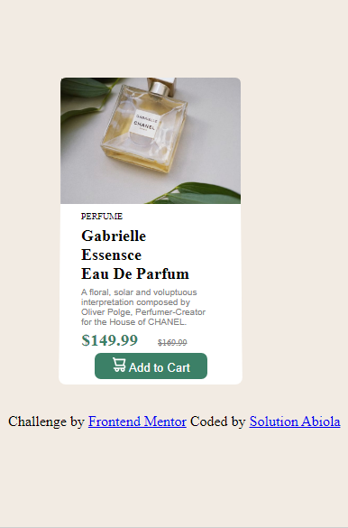

# Frontend Mentor - Product preview card component solution

This is a solution to the [Product preview card component challenge on Frontend Mentor](https://www.frontendmentor.io/challenges/product-preview-card-component-GO7UmttRfa). Frontend Mentor challenges help you improve your coding skills by building realistic projects. 

## Table of contents

- [Overview](#overview)
  - [The challenge](#the-challenge)
  - [Screenshot](#screenshot)
  - [Links](#links)
- [My process](#my-process)
  - [Built with](#built-with)
  - [Continued development](#continued-development)
- [Author](#author)
- [Acknowledgments](#acknowledgments)

## Overview

### The challenge

Users should be able to:

- View the optimal layout depending on their device's screen size
- See hover and focus states for interactive elements

### Screenshot

### Links

- Solution URL: (https://github.com/Soldiamond/Product-preview-card-component-challenge-on-Frontend-Mentor.com)
- Live Site URL: (https://soldiamond.github.io/Product-preview-card-component-challenge-on-Frontend-Mentor.com)

## My process

### Built with

- Semantic HTML5 markup
- CSS custom properties

### Continued development

I still need to work on reponsiveness of the page. As my mobile view looks really messed up.

## Author

- Website - (https://www.solutionabiola.com)
- Frontend Mentor - (https://www.frontendmentor.io/profile/soldiamond)

## Acknowledgments

Yeah, i give this to GOD. 
-My mentor(even if he does not know about this) and also w3schools
